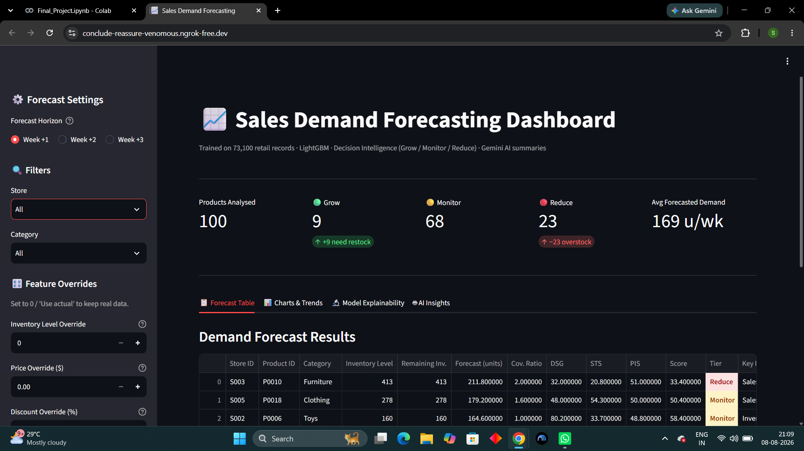
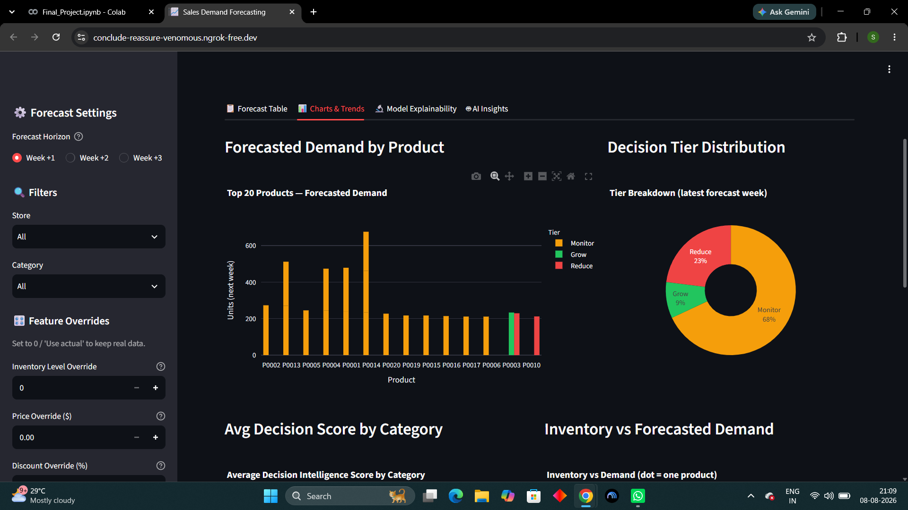
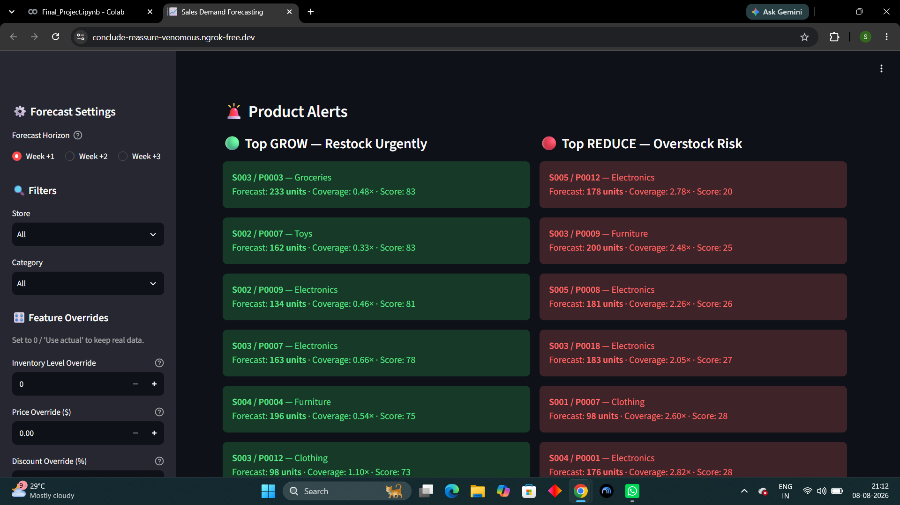
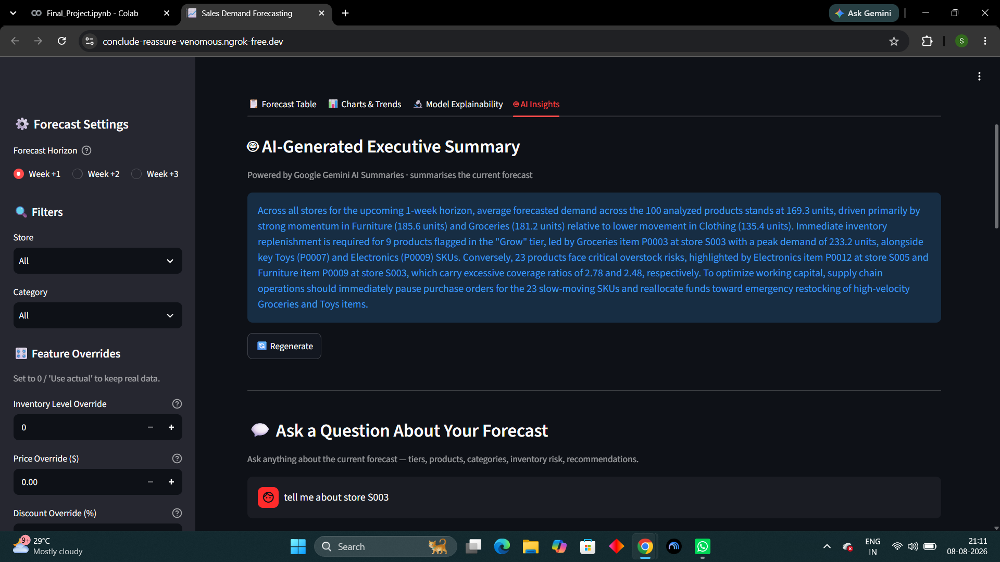
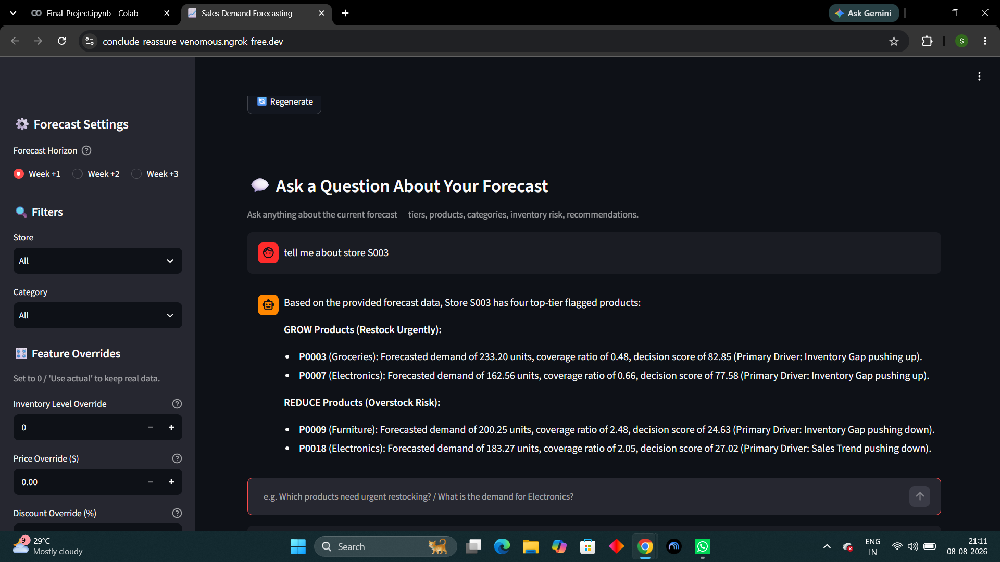
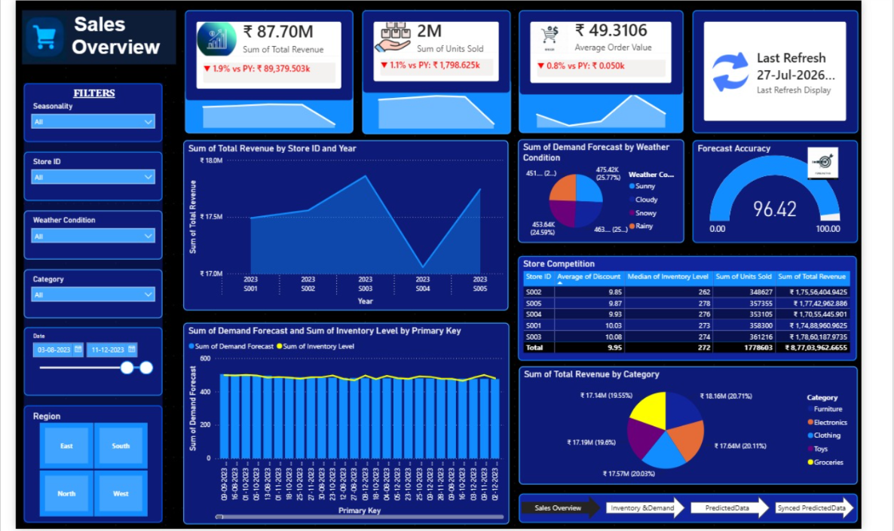

# 📈 AI-Powered Retail Demand Forecasting & Decision Intelligence

An end-to-end retail analytics system developed as a team project during Summer Training in Data Science and Data Analytics.

The project combines machine learning demand forecasting, decision intelligence, generative AI, PostgreSQL database integration, Streamlit and Power BI to support inventory planning and business decision-making.

## 🚀 Project Overview

Retail businesses need to balance overstocking and stock shortages while dealing with changing demand, pricing, promotions and inventory levels.

This project uses machine learning to forecast future demand and converts those predictions into actionable inventory recommendations.

### Key Components

- 📊 Demand Forecasting
- 🤖 LightGBM and XGBoost
- 🧠 Decision Intelligence
- 🔍 Model Explainability
- 💻 Streamlit Application
- ✨ Google Gemini AI
- ☁️ Supabase PostgreSQL
- 📈 Power BI

## 🏗️ System Architecture

Retail Data
↓
Data Preprocessing
↓
Feature Engineering
↓
LightGBM Forecasting
↓
Decision Intelligence
↓
Streamlit Application
↓
Supabase PostgreSQL
↓
Power BI

Google Gemini is integrated to generate AI-powered summaries and answer natural-language questions about forecast results.

## 📊 Model Performance

| Model | MAE | RMSE | WAPE |
|---|---:|---:|---:|
| Historical Average | 797.06 | 1112.77 | 21.81% |
| XGBoost | 703.10 | 975.45 | 19.24% |
| LightGBM | 686.54 | 952.45 | 18.79% |

LightGBM was selected as the final forecasting model based on its forecasting performance.

## 🧠 Decision Intelligence

The forecasting output is converted into actionable inventory recommendations using:

- Demand Supply Gap Score (DSG)
- Sales Trend Score (STS)
- Promotion Impact Score (PIS)

Products are classified into:

🟢 Grow — Restock

🟡 Monitor — Continue monitoring

🔴 Reduce — Overstock risk

## 🤖 Generative AI

Google Gemini is used to provide:

- Executive summaries
- Forecast insights
- Inventory recommendations
- Natural-language interaction with forecast results

## 💻 Streamlit Application

The application provides:

- 1–3 week demand forecasting
- Store and category filtering
- What-if analysis
- Inventory adjustments
- Price and discount adjustments
- Promotion adjustments
- Forecast visualizations
- Decision recommendations
- AI-generated insights

## ☁️ Automated Data Pipeline

A key component of the project is the database-backed workflow:

Forecast Model
↓
Forecast Results
↓
Supabase PostgreSQL
↓
Power BI

This removes the need for repeatedly downloading forecast CSV files and manually transferring them into the BI workflow.

## 📸 Project Screenshots

### Streamlit Dashboard



### Demand Forecast



### Decision Intelligence



### Gemini AI Insights



### Chat Assistance 



### Power BI Dashboard



## 🛠️ Technology Stack

Python | Pandas | NumPy | Scikit-learn | LightGBM | XGBoost | Matplotlib | Streamlit | Plotly | Google Gemini | PostgreSQL | Supabase | Streamlit | Power BI | Google Colab

## 👥 Team Members

This project was collaboratively developed as part of our Summer Training in Data Science and Data Analytics.

- **Sparsh Bhardwaj**
- **Shree Sharma**
- **Chandni Kumar**
- **Aniket Singh**

## 📁 Repository Structure

```text
retail-demand-forecasting/
│
├──  📓 retail-demand-forecasting.ipynb
├──  📄 Requirements.txt
├──  📊 retail_store_inventory.csv
├──  📄 README.md
│
└── screenshots/
    ├── streamlit-dashboard.png
    ├── demand-forecast.png
    ├── decision-intelligence.png
    ├── gemini-insights.png
    ├── gemini-chat-assistance.png
    └── powerbi-dashboard.png
```
---
# 📜 License

This project is open-source and intended for educational and learning purposes.

---

## Connect With Me

**Sparsh Bhardwaj**

LinkedIn: *(www.linkedin.com/in/sparshbhardwaj7)*

---


## ⭐ If you found this project interesting, consider giving it a star!
